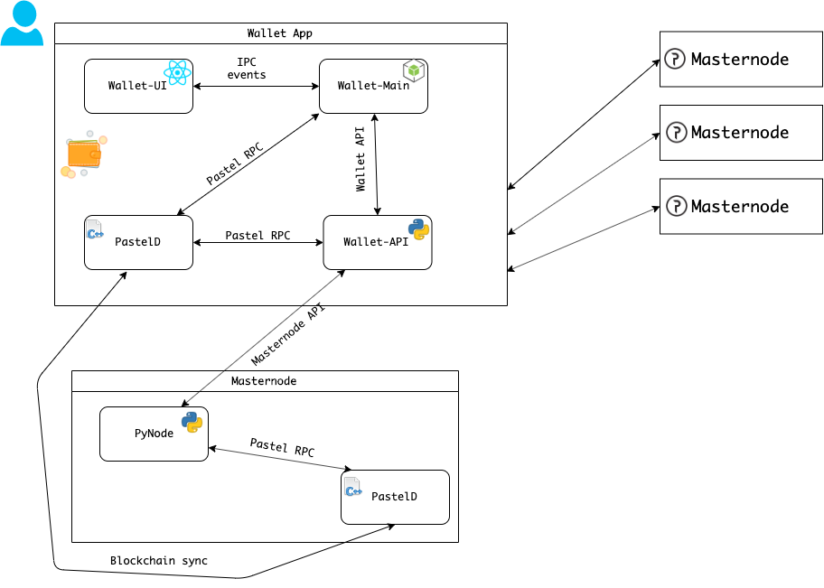

### Pastel wallet architecture overview

This document describes wallet-ralated part of the system and its interactions.

#### Wallet app components
 - Electron.js wallet applications. Includes renderer part (UI) and main part (everything else, like access to the file system, network, using APIs).
 - Python api service. Is a proxy between wallet and Pastel network.
 - PastelD. Base Pastel node application.

#### System parts detailed
###### Wallet UI
Is a React/Redux application which renders UI, handles user input events. For any system-level functionality (like network access) UI process interacts with Main process using Electron.js IPC events.

###### Wallet main
Is a `node.js` process which creates application window. Main process bidirectionally interacts with UI process using Electron.js IPC.
Also Main process interacts with `wallet_api` (python API service) for example, when creating tickets.
Wallet main communicated with `pasteld` process using `pastel-rpc` protocol, for example for obtaining user's wallet address or sending funds to another wallet.

###### `wallet_api` (python API service)
Is a python `iohttp`-based application, which handles http requests. It is required user's `PastelID` and `passphrase` to run. Its API has no authentication, because it accepts only local requests. `wallet_api` communicates with both local `pasteld` (to send funds) and with remote pyNodes (for registering new artworks and using other masternode-provided services)

###### `pasteld`
Serves local requests from `Wallet Main` and `wallet_api`. Comunicates with other `pasteld` application across the network.
